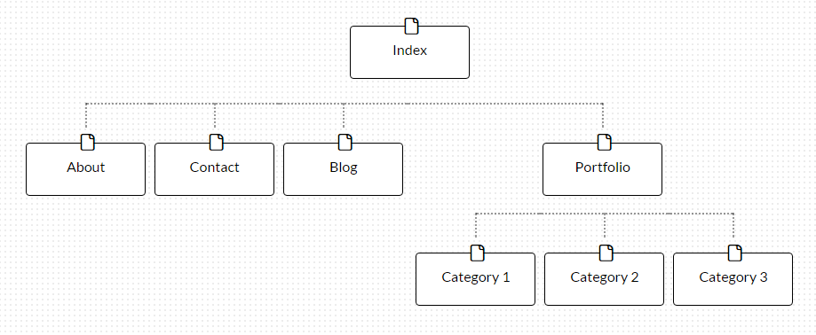

## What are the 6 Phases of Web Design?

The six phases of web design are as follows:

1.	Information Gathering  
	*Understanding the purpose of your website, considering the audience you are trying to target, and the end goal you are trying to achieve.*
2.	Planning  
	*Building a site map to understand the basic skeleton your website will follow.*
3.	Design  
	*Creating the look and feel of the website by using layouts, colors, and fonts to build a strong identity.*
4.	Development  
	*Turning the graphic elements from the design phase into a functional website by adding code and content management systems.*
5.	Testing and Delivery  
	*Ensuring that the website meets the latest standards for web development, checking the code for validation to these standards, and optimizing the site for search engines. The files are then transferred to the client's server.*
6.	Maintenance  
	*The continual update of the site over time to keep information and content up-to-date.*

## What is your site's primary goal or purpose? What kind of content will your site feature?

The primary goal of this site is to deliver information - specifically, information about what I've learned in my time at Dev Bootcamp and the successful results of those experiences. This information will be used to hopefully show potential employers what I am capable of, as well as my willingness and interest to learn more. The site will feature finished projects as well as a blog detailing my thought processes and reflections along the way.

## What is your target audience's interests and how do you see your site addressing them?

Potential employers will want to know that I'm capable of quickly learning new skills. I think the best content of the website to show that will be the blog. After all, just being able to regurgitate the code for a specific language isn't that impressive by itself. The real value comes from how you learned the skills, and how you can apply those skills to quickly learn new languages, frameworks, and other technologies. Therefore, I'd want to make the blog content very prominent on the site.

## What is the primary "action" the user should take when coming to your site? Do you want them to search for information, contact you, or see your portfolio? It's ok to have several actions at once, or different actions for different kinds of visitors.

Primarily, the visitor should be quickly directed to my portfolio and the accompanying commentary. I'd want to have contact information readily available on each page of the site so that if a potential employer did decide to contact me, they wouldn't need to search far on the site to find my information.

## What are the main things someone should know about design and user experience?

Design is a collaborative process. Even though you may be the 'driver' for creating the design of a website, there are both user's and client's needs to consider. Design does not happen in a vacuum - everything you create should be done with the intention of having a real person use and understand your creation. Building a strong foundation for your site in the Information Gathering and Planning phases will make the Design phase much easier.

## What is user experience design and why is it valuable? 

User experience design is to try and envision how the site would work from the user's perspective. It's one thing to make a website functional, but if the site is ugly or confusing, nobody will use it. It is useful to stand back from an outside perspective and consider how you would approach the site the first time you navigated to it. By including that thought process in your design loop, you will make a site that is more user-friendly.

## Which parts of the challenge did you find tedious?

I didn't really think any of this was tedious! Honestly, all of this new knowledge has been very fascinating. While some of the commands are becoming rote (for example, basic command line usage or git), it always feels good to get more practice in these early stages.