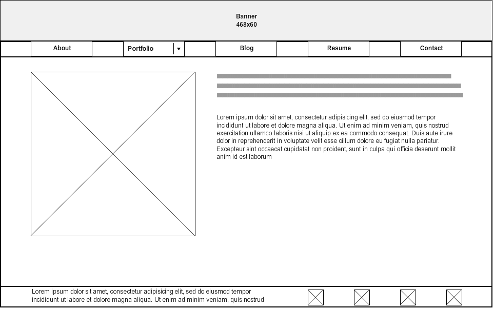
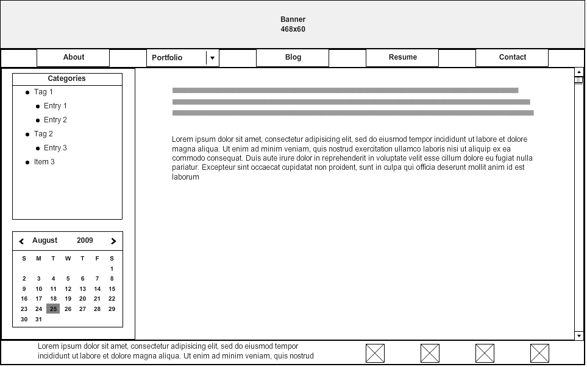

# Reflections

## What is a wireframe?

A wireframe is a barebones skeleton of what the actual webpage will look like. This includes sketched drawings of the size, position, and function of each element on the page. Wireframes can be created using mock-up programs, but can also simply be sketched out with pencil and paper.

## What are the benefits of wireframing?

Wireframing lets you sketch out how the site will look before you start coding your first line of HTML or CSS. This means that when you do begin programming, you already have a clear vision of what the site should look like, which means your design and development phases will be much more streamlined and efficient. Wireframing also allows you to consider the user experience when laying out the website. Because a wireframe is stripped down to the most basic elements on the page, it is easier to see whether the site is usable and user-friendly before focusing on smaller details in the CSS, such as color or fonts.

## Did you enjoy wireframing your site?

Yes! Although, I did have some trouble with the particular wireframe web app I chose to use (Mockflow). The interface was not very intuitive and it took some playing around with it to fully understand its capabilities. I think I would enjoy working on the wireframe more by using pencil and paper, although I can certainly see the benefits in the precision a computer-aided wireframing solution provides.

## Did you revise your wireframe or stick with your first idea?

Both? I started with the initial idea and revised upon it once complete. After laying out the basic components of the site, I kept adjusting and adding new elements until I was satisfied with the final result. It looks fairly similar to my initial idea, but has some changes I wouldn't have originally considered when first designing the idea in my head.

## What questions did you ask during this challenge? What resources did you find to help you answer them?

There are a lot of resources to look at for wireframing examples! The linked resource to the I Love Wireframes site had some very good examples to draw on for inspiration. I would like to keep researching different wireframing tools to find one I am most comfortable with.

## Which parts of the challenge did you enjoy and which parts did you find tedious?

I enjoyed getting creative with my website layout! I know that everyone will have a different solution to this challenge and I'm excited to see what other people come up with. I thought that the actual wireframing in the mockup tool I chose was a little tedious, but was satisfied with the end result. I will experiment with other tools to see if there is something more comfortable to use.