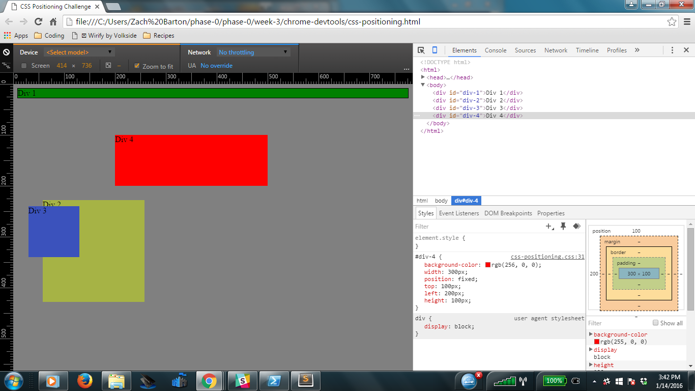
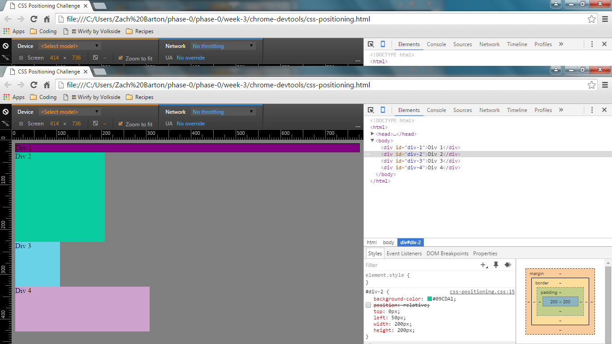
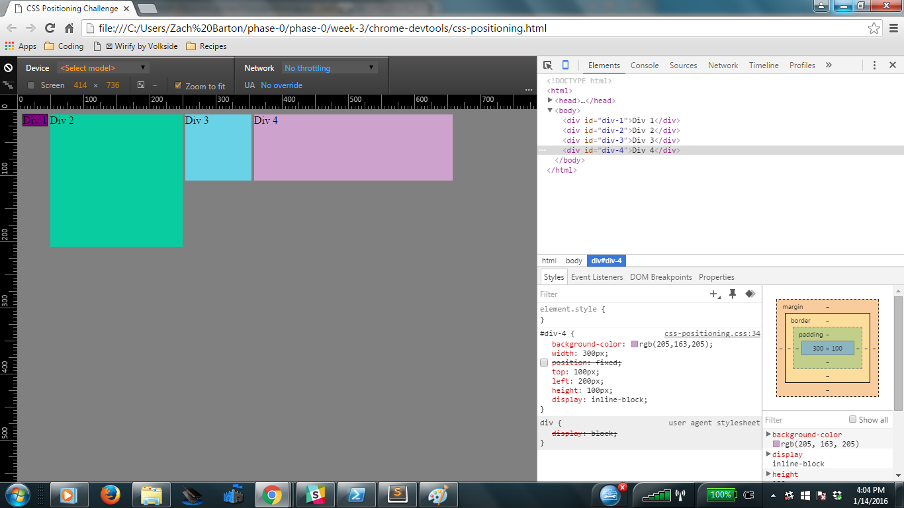
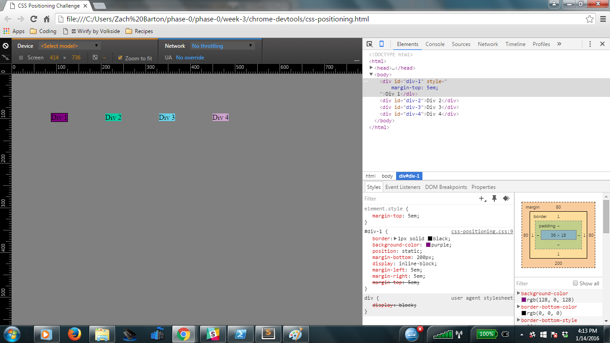
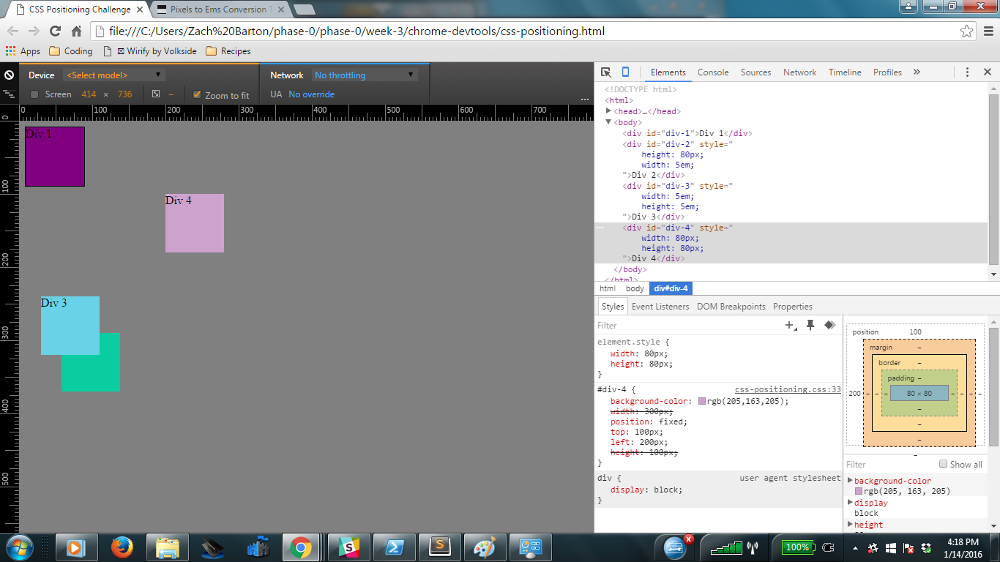
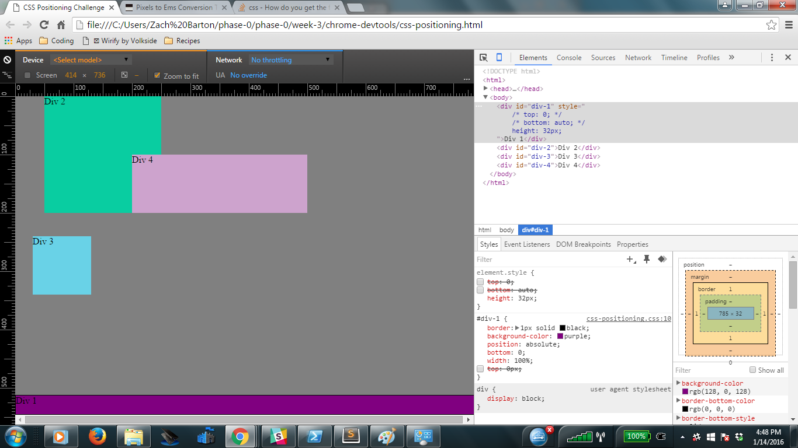
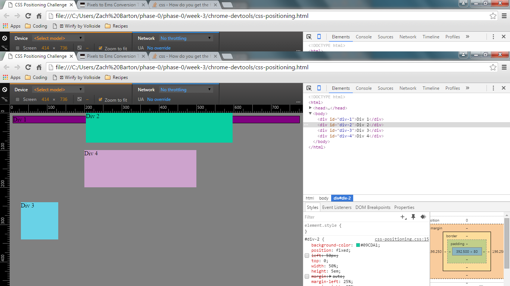
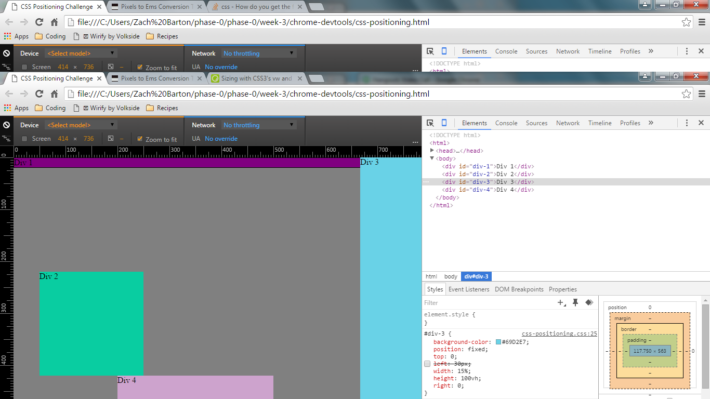
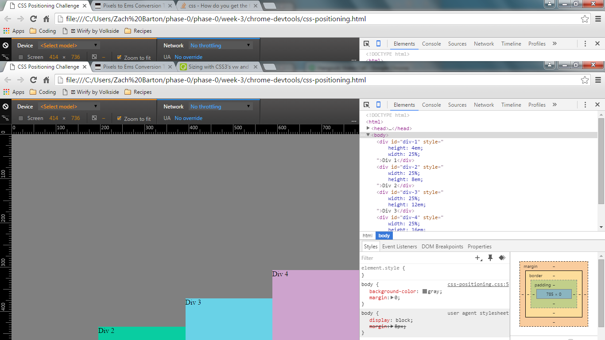

# Reflections

### How can you resize elements on the DOM using CSS?

There are a couple of different ways to modify the width and height properties through the DOM. One method is to insert or change the height and width properties in the CSS. The simpler way is to select the element in question and enter the height and width directly in the box model. The box model will accept measurements in pixels, em, or even percentages, which makes it incredibly convenient.

### What are the differences between absolute, fixed, static, and relative positioning? Which did you find easiest to use? Which was most difficult?

I had a little bit of trouble wrapping my head around the differences at first, but this is my understanding of the differences in the position property attributes:

	- Static: This is the default positioning attribute, which means that if there was no CSS applied to the html, all of the elements would be assumed to have static positioning. Static positioning means that the element is not affected by any directional properties such as top, bottom, left, or right.
	- Relative: Elements that have relative positioning are moved relative to its original (static) position. This means that relatively positioned elements are affected by directional properties, such as top, bottom, left, and right. These are processed from the static position - meaning that the new position of the element will be shifted a given distance from where it would originally appear without positioning. What's more, the other elements in the page are not affected by its new positioning. The other elements will behave as if the relative positioned element remained in its static position.
	- Absolute: An absolute positioned element is also positioned relatively, but in this case it is relative to the next higher element in the HTML hierarchy strucutre (such as the div containing an absolutely positioned div). If there are no other divs or sections in the hierarchy, the absolute positioned element will behave like a fixed position element. This positioning is controlled by directional properties.
	- Fixed: A fixed position element retains its position relative to the user's screen, regardless of browser window size or scrolling the page. The fixed position is set by using the directional properties.

Obviously static was the easiest to implement, but was not very useful in the exercises. Fixed positions were also very easy to understand, and were helpful for setting header, footer, and sidebar divs. Relative and absolute positions were a little harder to understand but the rapid iterations through DOM allows us to experiment with their behavior and understand why it works the way it does.

### What are the differences between margin, border, and padding?

Margins, borders, and padding are different methods of adding spacing between elements. Working from the element outward, the order is padding, border, and finally margin. These allow you to add additional space between elements regardless of positioning - which can be important, because positioned elements are allowed to overlap. Padding is space directly outside of the element's content, but inside the div. Padding can have a different background color than the element. Borders are used to define the edges of the div. Borders can be assigned a thickness, color, and line style. Finally, margins add space outside of the div container. This allows you to perform tricks such as centering elements independent of page width.

### What was your impression of this challenge overall? (love, hate, and why?)

It was a somewhat difficult challenge but I really enjoyed it. Working with the Dev Tools and the DOM allowed us to make a lot of rapid-fire changes to the CSS and observe the differences. It's a great learning tool and really allowed us to understand why certain properties act the way they do. Furthermore, it let us understand how the CSS structure works - for instance, properties assigned to elements can override the properties inherited from the body or html sections. I liked being able to get my hands dirty and mess around with the code quickly and without consequences.