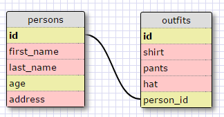

## Reflections

#### What are databases for?

Databases are for storing huge amounts of data. While arrays and hashes have been useful for smaller scope programs like the ones we have created,
a database is useful for much larger scale websites and projects.

#### What is a one-to-many relationship?

A one-to-many relationship is a good way to divide information into separate tables. For instance, a clothing item may be found in a store, but the store has many clothing items. So the store would be in a table with other stores, and the clothes belonging to each store would be in a separate table.

#### What is a primary key? What is a foreign key? How can you determine which is which?

A primary key is a column in a table that has a distinct and unique value for every row. A foreign key is a field in another table that refers to the primary key of another table. For instance, a primary key could be something as simple as an incremented value for Employee ID numbers. In another dependent table, such as a more detailed table keeping track of payroll or vacation, the Employee ID would be the foreign key that would tie the dependent table back to the parent.

#### How can you select information out of a SQL database? What are some general guidelines for that?

You can get information out of a database primarily through the SELECT command. You also have options to filter or include search terms by using WHERE to specify
conditions to define the search, or using % symbols as wild cards to include a specific phrase (such as %'Zach'% to search for multiple variations of Zach, Zachary, Zachariah, etc).