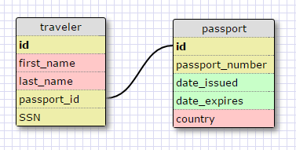
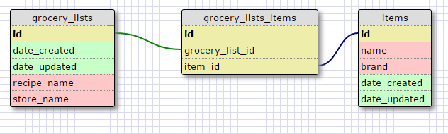

#### One-to-One Relationship

Each person can (or legally should!) only have one passport. Each passport has a unique passport number
Therefore, the person and their passport form a one-to-one relationship. We can separate the passport information
into a second table because if someone doesn't actually have a passport, all of the information in the passport
table will be NULL.

#### Many-to-Many Relationship

The grocery_lists table and the items table are joined by a common table where each of the foreign keys are stored.
We have specific information related to the list in the left-most table, and specific information about the item in
the right-hand table. To connect these two distinct tables, we have to link both of the primary IDs to a common table.

#### Reflections

##### What is a one-to-one database?

A one-to-one database is a relationship where the two items are a unique pair. This could be something like people
and date of birth, names and Social Security numbers, etc. 

##### When would you use a one-to-one database? (Think generally, not in terms of the example you created).

You can use a one-to-one database when you have distinct information on one side of the relationship that can either
be completely present, or completely absent. While you could keep most of that information in one single table, you can
separate the distinct information from one half of the pair so that you can avoid repeating multiple NULL values in one table.

##### What is a many-to-many database?

A many-to-many database is a relationship where each each half of the pair have multiple instances of each other. For instance,
a gym workout can be performed by many athletes, and athletes can have many gym workouts.

##### When would you use a many-to-many database? (Think generally, not in terms of the example you created).

You would use this type of relationship when both halves of the relationship have different, distinct fields. You would use the
join table to connect each of these distinct tables through their foreign keys.

##### What is confusing about database schemas? What makes sense?

The schemas are great - having a graphical way to distinguish where the relationships are connected is incredibly helpful. It's
very easy to translate the written relationships into an easy-to-understand graphical format. I am still having some issues
understanding the correct best practices to implement many-to-many relationships. I need to actually work with the join table
to understand how it works.